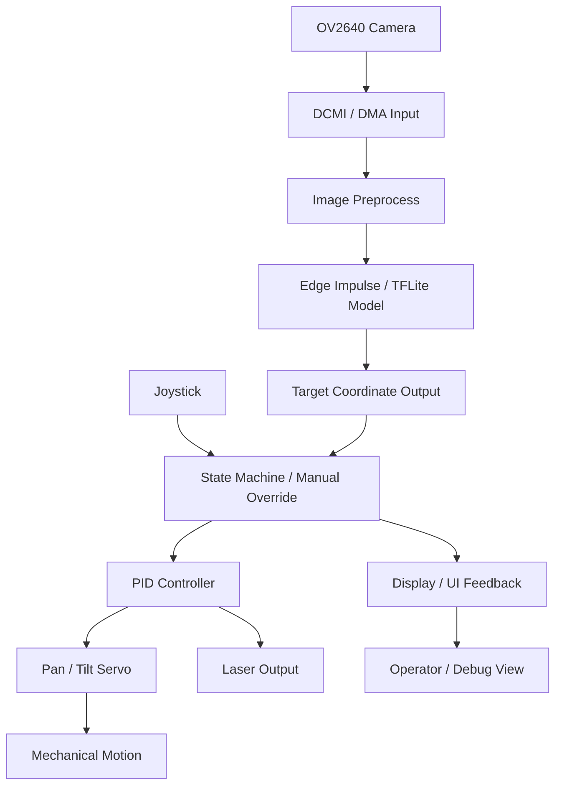

# AIMing_Project

AI 기반 목표 탐지 및 추적 시스템을 STM32H7 보드 위에서 구현한 임베디드 프로젝트입니다.  
카메라 입력을 받아 경량화된 객체 탐지 모델로 타깃을 인식하고, 서보모터와 레이저 제어를 통해 실시간으로 추적 및 조준하는 흐름을 구성했습니다.
본 프로젝트에서는 드론을 탐지하여 추적하는 모델을 사용하였습니다.

## 🎬 Demo Video

[](https://www.youtube.com/watch?v=joX70CCl_hw)

## Project Overview

이 프로젝트는 다음 3가지로 구성되어 있습니다.

- Embedded Firmware: STM32H743XIH6 기반의 실시간 제어와 하드웨어 인터페이스 구현
- AI Vision: FOMO 기반 경량 모델을 이용한 실시간 객체 탐지
- Simulation: 가상 환경에서 추적/조준 동작을 검증

---

## Key Highlights

- STM32H7 보드에서 카메라 입력 처리
- Edge Impulse / TensorFlow Lite 기반 실시간 추론
- 2축 서보 제어를 통한 Pan/Tilt 목표 추적
- 레이저 조준 및 상태 머신 기반 동작 제어
- FreeRTOS 기반 멀티태스크 실행
- 모델 학습, 평가, 양자화, 배포까지 포함한 AI 파이프라인
- PC 기반 성능 시험 자동화 및 결과 분석

---

## System Architecture



이 구조는 카메라로부터 입력을 받아 AI로 판단하고, 그 결과를 제어 신호로 바꾸어 하드웨어를 구동하는 흐름을 보여줍니다.

---

## Repository Structure

```text
AIMing_Project/
├── aiming_project/        # STM32H7 임베디드 펌웨어 프로젝트
├── FOMO_Local/            # FOMO 모델 학습, 평가, 양자화 파이프라인
├── PerformanceTest/       # AI 성능 테스트 및 하드웨어 PoC 도구
├── Simul/                 # 시뮬레이션 및 시각화 코드
```

### Directory Overview

- aiming_project
  - STM32CubeIDE / CubeMX 기반 펌웨어 프로젝트
  - 카메라, LCD, ADC, PWM, UART, FreeRTOS 관련 코드 포함

- FOMO_Local
  - FOMO 모델 학습, 검증, 평가, 양자화, TFLite export 파이프라인

- PerformanceTest
  - AI 검출 성능과 하드웨어 PoC 시험을 위한 자동화 스크립트 모음

- Simul
  - 추적/조준 동작을 시뮬레이션하고 시각화하는 코드

---

## Development Workflow

1. 임베디드 펌웨어 빌드 및 보드 실행
2. AI 모델 학습 및 양자화 진행
3. 성능 테스트로 모델 및 하드웨어 동작 검증
4. 시뮬레이션 또는 실제 하드웨어에서 추적/조준 확인

---

## Getting Started

### 1. Firmware

1. STM32CubeIDE 또는 VS Code 환경에서 [aiming_project](aiming_project) 폴더를 엽니다.
2. [aiming_project/aiming_project.ioc](aiming_project/aiming_project.ioc) 파일을 확인합니다.
3. 프로젝트를 빌드한 뒤 STM32H7 보드에 플래시합니다.

### 2. AI Model

1. [FOMO_Local](FOMO_Local) 폴더로 이동합니다.
2. Python 환경을 준비한 뒤 필요한 패키지를 설치합니다.
3. 학습 및 평가를 진행합니다.
   - `python train.py`
   - `python evaluate.py`
   - `python validation_evaluate.py`
4. 양자화 및 TFLite export를 진행합니다.
   - `python quantize_model_PTQ.py`
   - `python export_qat_int8.py`

### 3. Performance Test

1. [PerformanceTest](PerformanceTest) 폴더로 이동합니다.
2. 데이터셋 준비:
   - `python prepare_dataset.py`
3. AI 성능 평가:
   - `python ai_test.py`
4. 하드웨어 PoC 시험:
   - `python poc_test.py`

### 4. Simulation

1. [Simul](Simul) 폴더로 이동합니다.
2. 시뮬레이션 스크립트를 실행해 동작을 확인합니다.

---

## Tech Stack

- MCU: STM32H743
- RTOS: FreeRTOS
- AI: TensorFlow / TensorFlow Lite / Edge Impulse
- Languages: C / C++ / Python
- Tools: STM32CubeIDE, VS Code

---

## Project Highlights

- 임베디드 환경에서 실시간 추론을 구현한 점
- AI와 제어 로직을 실제 하드웨어에 연결한 점
- 모델 성능 검증과 하드웨어 PoC를 분리해 실험한 점
- 포트폴리오로 설명하기 좋은 end-to-end 구조를 갖춘 점

---

## References

- [aiming_project/README.md](aiming_project/README.md)
- [FOMO_Local/README.md](FOMO_Local/README.md)
- [PerformanceTest/README.md](PerformanceTest/README.md)

---

## Next Steps

- 하드웨어 구성 사진 추가
- 실제 동작 영상 추가
- 아키텍처 다이어그램 보강
- 실행 방법과 결과 지표를 더 상세히 정리
