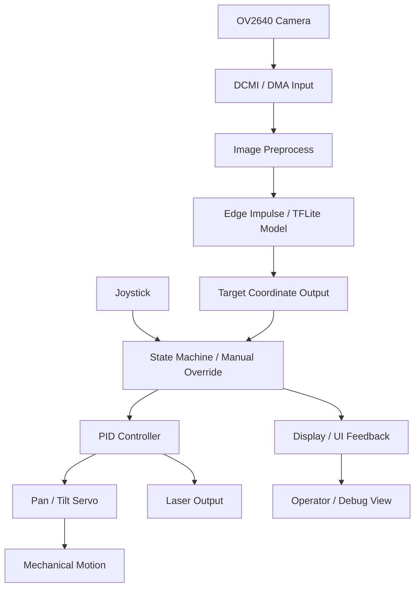

# AIMing Project

> **STM32H743 기반 On-Device AI 목표 탐지·추적 및 Pan/Tilt 조준 시스템**

카메라 영상을 STM32H7에서 처리하고, 경량 객체 탐지 모델을 통해 드론
타깃을 인식한 뒤 Pan/Tilt 서보와 레이저를 제어하여 실시간 추적·조준하는
임베디드 AI 프로젝트입니다.

------------------------------------------------------------------------

## 🎬 Demo

[](https://www.youtube.com/watch?v=Eg0nYeOGCXA)

------------------------------------------------------------------------

## 1. Project Overview

AIMing은 **Embedded Firmware / AI Vision / Simulation**을 하나의
흐름으로 연결한 프로젝트입니다.

-   **Embedded Firmware**
    -   STM32H743XIH6 기반 실시간 제어
    -   OV2640 카메라 입력 처리
    -   Pan/Tilt 서보 및 레이저 제어
    -   LCD, ADC, PWM, UART 등 하드웨어 인터페이스
    -   FreeRTOS 기반 멀티태스크 실행
-   **AI Vision**
    -   FOMO 기반 경량 객체 탐지
    -   Edge Impulse / TensorFlow Lite 기반 추론
    -   모델 학습, 평가, 양자화 및 TFLite Export
-   **Simulation & Validation**
    -   PC 환경에서 추적·조준 동작 시뮬레이션
    -   AI 검출 성능 평가
    -   하드웨어 PoC 시험

------------------------------------------------------------------------

## 2. Key Features

-   STM32H7에서 카메라 입력 및 AI 추론 파이프라인 구성
-   FOMO 기반 드론 객체 탐지
-   탐지 좌표를 이용한 2축 Pan/Tilt 타깃 추적
-   레이저 출력 및 상태 머신 기반 동작 제어
-   Joystick 기반 Manual Override
-   FreeRTOS 기반 기능 분리
-   모델 학습 → 평가 → 양자화 → 배포 흐름 구성
-   AI 성능 시험과 하드웨어 PoC 시험 분리

------------------------------------------------------------------------

## 3. System Architecture


``` mermaid
flowchart TD
    CAM[OV2640 Camera] --> DCMI[DCMI / DMA Input]
    DCMI --> PRE[Image Preprocess]
    PRE --> AI[Edge Impulse / TFLite Model]
    AI --> CTRL[Target Coordinate Output]

    JOY[Joystick] --> FSM[State Machine / Manual Override]
    CTRL --> FSM

    FSM --> PID[PID Controller]
    PID --> SERVO[Pan / Tilt Servo]
    PID --> LASER[Laser Output]

    SERVO --> ACT[Mechanical Motion]
    FSM --> LCD[Display / UI Feedback]
    LCD --> USER[Operator / Debug View]
```

카메라 입력을 AI 모델이 분석하여 타깃 좌표를 생성하고, 상태 머신과 제어
로직을 거쳐 Pan/Tilt 서보 및 레이저를 구동하는 구조입니다. Joystick
입력을 이용한 수동 제어와 LCD 기반 상태 확인도 함께 구성했습니다.

------------------------------------------------------------------------

## 4. Development Flow

``` text
Camera Input
    ↓
Image Preprocess
    ↓
FOMO Object Detection
    ↓
Target Coordinate
    ↓
State Machine / Manual Override
    ↓
Tracking Control
    ↓
Pan / Tilt Servo + Laser
```

AI 모델 개발은 다음 흐름으로 구성되어 있습니다.

``` text
Dataset
   ↓
Training
   ↓
Evaluation / Validation
   ↓
PTQ / QAT Quantization
   ↓
TFLite Export
   ↓
Embedded Deployment / Performance Test
```

------------------------------------------------------------------------

## 5. Repository Structure

``` text
AIMing_Project/
├── aiming_project/        # STM32H7 임베디드 펌웨어
├── FOMO_Local/            # FOMO 학습·평가·양자화 파이프라인
├── PerformanceTest/       # AI 성능 평가 및 하드웨어 PoC
├── Simul/                 # 추적·조준 시뮬레이션 및 시각화
└── README.md
```

### `aiming_project/`

STM32CubeIDE / CubeMX 기반 펌웨어 프로젝트입니다.

-   Camera
-   LCD
-   ADC
-   PWM
-   UART
-   FreeRTOS
-   Pan/Tilt Servo
-   Laser Control

### `FOMO_Local/`

FOMO 모델 개발 파이프라인입니다.

-   Training
-   Evaluation
-   Validation
-   PTQ / QAT Quantization
-   TFLite Export

### `PerformanceTest/`

모델 및 하드웨어 검증을 위한 시험 코드입니다.

-   데이터셋 준비
-   AI 검출 성능 평가
-   하드웨어 PoC 시험

### `Simul/`

추적 및 조준 동작을 PC 환경에서 확인하기 위한 시뮬레이션 코드입니다.

------------------------------------------------------------------------

## 6. Performance & Validation

저장소는 AI 성능 평가와 하드웨어 PoC를 분리하여 검증할 수 있도록
구성되어 있습니다.

``` bash
cd PerformanceTest

python prepare_dataset.py
python ai_test.py
python poc_test.py
```

---

## 7. Team & Contributions

본 저장소는 **4인 팀 프로젝트의 공동 저장소**입니다.

| 팀원 | 담당 영역 | 주요 구현 |
| --- | --- | --- |
| 이명욱 | Embedded / System Integration | 전체 코드 통합, OV2640 카메라 제어 및 STM32 시스템 연동 |
| 양시영 | HMI / Performance Test | LCD HMI 구현, 성능 검증 항목 설계 및 테스트 프로그램 구현 |
| 조병현 | Control / Simulation | PID 모터 제어, PyBullet 시뮬레이션 환경 구축 및 가상환경 테스트 |
| 황은하 | AI Model | FOMO 기반 AI 모델 개발, 학습 데이터 구성 및 모델 최적화 |

---

## 8. Tech Stack

| Category | Technology |
| --- | --- |
| MCU | STM32H743 |
| RTOS | FreeRTOS |
| AI | TensorFlow / TensorFlow Lite / Edge Impulse / FOMO |
| Language | C / C++ / Python |
| Simulation | PyBullet |
| Tools | STM32CubeIDE / STM32CubeMX / VS Code |

---

## 9. References

-   [`aiming_project/README.md`](aiming_project/README.md)
-   [`FOMO_Local/README.md`](FOMO_Local/README.md)
-   [`PerformanceTest/README.md`](PerformanceTest/README.md)

각 파트의 세부 구현 및 시험 방법은 하위 README를 참고합니다.
