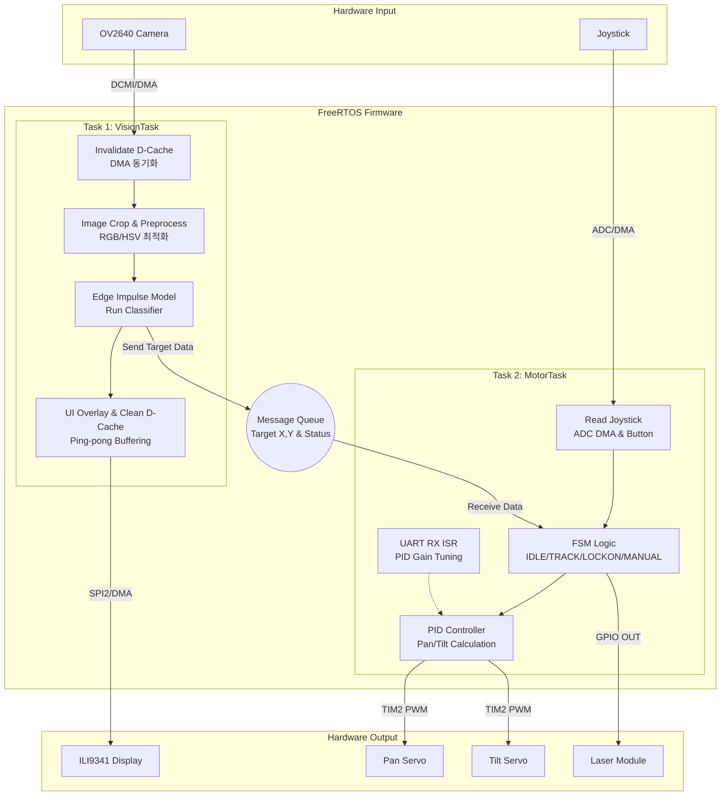

# **AI-Powered Laser Tracking Turret (STM32H7)**

STM32H7 마이크로컨트롤러와 Edge Impulse AI 비전 모델을 활용하여 실시간으로 객체를 탐지하고, 2축 서보모터(Pan/Tilt)와 실시간 PID 제어를 통해 타겟을 추적하여 레이저를 조준하는 임베디드 시스템입니다. 본 프로젝트에서는 드론을 탐지하여 추적하는 모델을 사용하였습니다.

## **하드웨어 (Hardware Components)**

* **MCU Board:** STM32H743XIH6 (Cortex-M7)  
* **Camera:** OV2640
* **Display:** ILI9341 320x240 TFT LCD 
* **Actuators:** SG90 / MG90 2축 서보모터 (Pan & Tilt)  
* **Input:** 아날로그 2축 조이스틱
* **Effector:** 5V 레이저 다이오드 모듈

## **스펙 (Specifications)**

| 항목 | 상세 규격 |
| :---- | :---- |
| **Core** | ARM Cortex-M7 (Hardware FPU FPv5-D16 적용) |
| **OS** | FreeRTOS (CMSIS-RTOS V2) |
| **AI Vision** | Edge Impulse SDK (C++), Input: 96x96 RGB888 |
| **Camera FPS** | \7.1 FPS (추론 및 전처리 오버헤드 포함) |

## **주요 기능 (Key Features)**

1. **온디바이스 AI 추론 (Edge AI Vision)**  
   * Edge Impulse C++ SDK를 활용하여 클라우드 연결 없이 기기 자체에서 타겟 객체 탐지 수행
   * Cortex-M7의 FPU 및 Data Cache(SCB\_InvalidateDCache, SCB\_CleanDCache)를 제어하여 DMA와 CPU 간 데이터 정합성 보장 및 추론 속도 극대화
2. **실시간 정밀 추적 (Real-Time Tracking & PID)**  
   * Pan / Tilt 축에 독립적인 PID 제어기 적용. UART 인터럽트를 통해 시스템 런타임 중에도 Kp, Ki, Kd 게인 값 실시간 튜닝 가능
   * 🟢 IDLE (자동 순찰) \-\> 🟡 TRACKING (목표 추적) \-\> 🔴 LOCKON (목표 사격) \-\> 🔵 MANUAL (수동 제어) 4단계 상태 머신(FSM) 구동
3. **병목 없는 디스플레이 렌더링 (Zero-Overhead Display)**  
   * 2중 스캔라인(Ping-Pong Buffer) 기반 SPI DMA 전송
   * 좌표 변환 연산 오버헤드를 없애기 위한 룩업 테이블(LUT) 기반 이미지 스케일링
4. **하드웨어 제어 (ADC DMA & DCMI)**  
   * 조이스틱 X/Y 아날로그 값을 백그라운드 ADC DMA로 폴링하여 FPU로 정규화 및 데드존 필터링
   * DCMI 버스를 통해 CPU 개입 없이 OV2640 카메라 이미지를 SRAM으로 직접 수신

## **하드웨어 연결 (Pinout & Peripherals)**

| Module | Peripheral | Pins / Function |
| :---- | :---- | :---- |
| **OV2640** | DCMI / I2C1 | D0\~D7, PCLK, VSYNC, HSYNC / SCL, SDA |
| **ILI9341** | SPI2 | MOSI, SCK / GPIO (CS, DC, RST, LED) |
| **Pan Motor** | TIM2\_CH1 | PWM Output (50Hz) \- 좌우 회전 (180도) |
| **Tilt Motor** | TIM2\_CH2 | PWM Output (50Hz) \- 상하 회전 (180도) |
| **Joystick** | ADC1 | Analog X, Analog Y (DMA) / GPIO (Button) |
| **Laser** | GPIO | Digital Output (Target Lock-on 시 HIGH) |
| **PC Comm** | USART1 | TX, RX (Baudrate: 115200\) \- PID 튜닝용 |

## **시스템 아키텍처 (System Architecture)**

FreeRTOS를 기반으로 설계되었으며, 카메라 처리/AI 추론을 담당하는 **Vision Task**와 물리적 제어를 담당하는 **Motor Task**가 Queue와 Semaphore를 통해 유기적으로 상호작용합니다.

## **IDE 및 컴파일러 설정 (CubeIDE Settings)**

Edge Impulse C++ 모델과 STM32 HAL C 코드를 함께 빌드하기 위해 아래와 같이 프로젝트 속성(Properties)을 설정했습니다.

1. **MCU/MPU Settings**  
   * Floating-point unit: FPv5-D16  
   * Floating-point ABI: Hardware implementation (-mfloat-abi=hard)  
2. **C/C++ Compiler Optimization (속도 최적화)**  
   * Optimization level: Optimize for speed (-Ofast)  
   * Disable handling exceptions (-fno-exceptions) : 체크 ✅  
   * Do not use \_\_cxa\_atexit for registering static destructors (-fno-cxa-atexit) : 체크 ✅  
3. **Runtime Library (Printf/Scanf 설정)**  
   * Use float with printf from newlib-nano (-u \_printf\_float) : 체크 ✅  
   * Use float with scanf from newlib-nano (-u \_scanf\_float) : 체크 ✅  
4. **Paths and Symbols (디렉토리 참조)**  
   * Includes 탭(GNU C/C++): /${ProjName}/EdgeImpulse, /${ProjName}/Core/Inc/App, Modules, Tasks 추가
   * Source Location 탭: 빌드 패스에 Core, Drivers, EdgeImpulse, Middlewares 폴더 정상 등록

## **사용법 (How to Use)**

### **1\. 조이스틱 수동 조작 (Joystick)**

* **버튼 클릭:** AUTO 모드(자동 추적 및 순찰)와 MANUAL 모드(수동 조작)를 토글합니다
* **스틱 이동:** 수동 모드에서 카메라의 시야각(Pan/Tilt)을 자유롭게 조작할 수 있습니다.

### **2\. 시리얼 통신을 통한 PID 실시간 튜닝 (Baud: 115200\)**

시리얼 터미널(PuTTY, TeraTerm 등)을 통해 실행 중인 시스템의 PID 게인을 조절할 수 있습니다.

* **Pan(좌/우) 축 튜닝 (소문자)**  
  * q / a : Kp 증가 / 감소  
  * w / s : Ki 증가 / 감소  
  * e / d : Kd 증가 / 감소  
* **Tilt(상/하) 축 튜닝 (대문자)**  
  * Q / A : Kp 증가 / 감소  
  * W / S : Ki 증가 / 감소  
  * E / D : Kd 증가 / 감소  
* **키보드 수동 모터 테스트**  
  * i, k, j, l : 각각 상, 하, 좌, 우로 모터 강제 제어

## **폴더 구조 (Directory Structure)**

📦 Project  
 ┣ 📂 Core  
 ┃ ┣ 📂 Inc  
 ┃ ┃ ┣ 📂 App       \# 시스템 전역 상태 및 메인 헤더 (app\_globals.h, app\_main.h)  
 ┃ ┃ ┣ 📂 Modules   \# 카메라, 디스플레이, 조이스틱, 모터 모듈 헤더  
 ┃ ┃ ┗ 📂 Tasks     \# FreeRTOS 태스크 헤더 (task\_motor.h, task\_vision.h)  
 ┃ ┗ 📂 Src  
 ┃ ┃ ┣ 📂 App       \# C++ 메인 진입점 (app\_main.cpp) 및 테스트 데이터  
 ┃ ┃ ┣ 📂 Modules   \# 하드웨어 제어 세부 로직 (camera.c, display.c 등)  
 ┃ ┃ ┗ 📂 Tasks     \# RTOS 기반 AI 및 제어 태스크 로직  
 ┣ 📂 Drivers       \# STM32 HAL 드라이버 및 CMSIS  
 ┣ 📂 EdgeImpulse   \# Edge Impulse AI 모델 SDK 및 Classifier 라이브러리  
 ┣ 📂 Middlewares   \# FreeRTOS 소스 코드  
 ┗ 📜 aiming\_project.ioc \# STM32CubeMX 설정 파일  
